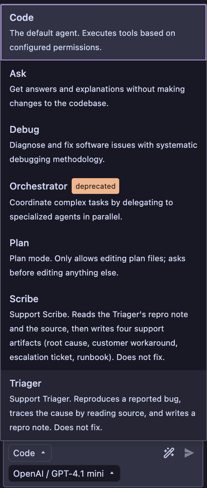

# kilo-support-copilot-demo

A small demo repo that showcases [Kilo Code](https://kilo.ai/) driving a support-engineering
workflow: reproduce a seeded bug, diagnose it, and produce the artifacts a
real support team would hand off (repro note, root-cause summary,
customer-facing workaround, escalation ticket, and runbook).

This is **lean v1**: one bug, two Kilo agents, no MCP. Bugs 2 and 3, a Fixer
agent with a regression test, and an MCP docs-lookup server are planned as
follow-ups.

## Layout

```
.
├── app/
│   ├── server/        Express + TypeScript API with one seeded bug
│   └── web/           Single static HTML login page (no build step)
├── .kilo/
│   ├── agents/        Kilo custom agents: triager.md, scribe.md
│   ├── bugs/          Symptom descriptions (no cause hints), input for the Triager
│   └── templates/     Markdown templates for each support artifact (including runbook)
├── scripts/
│   └── repro-01-auth-config.sh   Deterministic reproduction for bug 01
├── artifacts/         Per-bug subfolders (e.g. artifacts/01-auth-config/) where
│                      the Triager and Scribe write their output
└── images/            Screenshots used by this README
```

## Running the app manually

```
cd app/server
npm install
API_KEY=my-shell-key npm start
```

Then open http://localhost:3000 and try logging in with `my-shell-key`.

(Expected outcome for v1: you see `authentication failed`. That's the bug.)

## Reproducing bug 01

```
./scripts/repro-01-auth-config.sh
```

The script starts the server with an API key set in the shell, POSTs a login
request using the same key, and exits non-zero if the bug doesn't reproduce.

## Running the demo

Both agents are defined as markdown files in `.kilo/agents/`. Each file
combines a YAML frontmatter block (describing its permissions) with a
markdown body that serves as its system prompt. This follows Kilo's
custom-agents format (see [kilo.ai/docs/customize/custom-modes](https://kilo.ai/docs/customize/custom-modes)).
For v1 the two agents run **separately**: you manually switch from
Triager to Scribe via the agent picker after the Triager finishes.

### Step 0: Verify the agents are loaded

Open this repo in VS Code with the Kilo Code extension installed, then
open the Kilo sidebar. Click the agent picker (bottom-left of the chat
input). You should see **Triager** and **Scribe** listed alongside the
built-in agents, with their descriptions visible:



If either agent is missing, check the Kilo Code output panel in VS Code
(View → Output → "Kilo Code") for frontmatter validation errors.

### Step 1: Run the Triager

Select **Triager** from the picker and prompt it with:

> Triage the bug described in `.kilo/bugs/01-auth-config.md`. Follow
> your process and write the repro note.

The Triager is permitted to run `./scripts/repro-*.sh`, read the
codebase, and write into `artifacts/**`. It should produce
`artifacts/01-auth-config/repro-note.md`.

### Step 2: Run the Scribe

Switch to **Scribe** via the picker and prompt it with:

> Read `artifacts/01-auth-config/repro-note.md` and produce the four
> support artifacts for bug 01-auth-config.

The Scribe is read-only on source and writes into `artifacts/**`. It
should produce `root-cause.md`, `customer-workaround.md`,
`escalation-ticket.md`, and `runbook.md` in the same folder.

### Artifact scope

Artifacts are organized per-bug (e.g. `artifacts/01-auth-config/`).
Most artifacts are per-bug and accumulate ticket references across
reports; `customer-workaround.md` is per-ticket (subsequent customers
get `customer-workaround-<ticket>.md`).

## Status

- [x] Buggy server
- [x] Static login page
- [x] Repro script
- [x] Bug symptom file
- [x] Artifact templates (repro-note, root-cause, customer-workaround, escalation-ticket, runbook)
- [x] `.kilo/agents/triager.md` and `.kilo/agents/scribe.md`
- [ ] End-to-end dry run with the two agents
- [ ] Demo recording

## Follow-ups (not in v1)

- Fixer agent + regression test for bug 01
- Bug 02 (API/backend race) and Bug 03 (UI stale closure)
- MCP docs-lookup server used by the Scribe for citations
